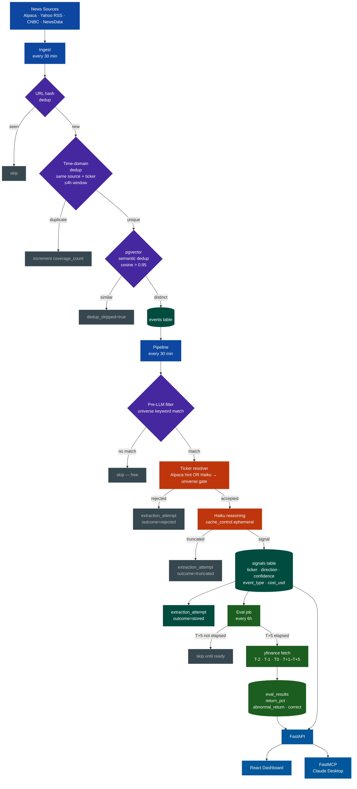
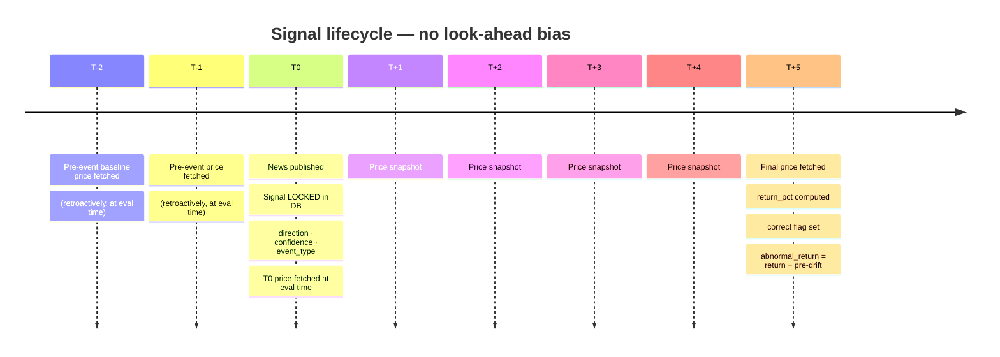
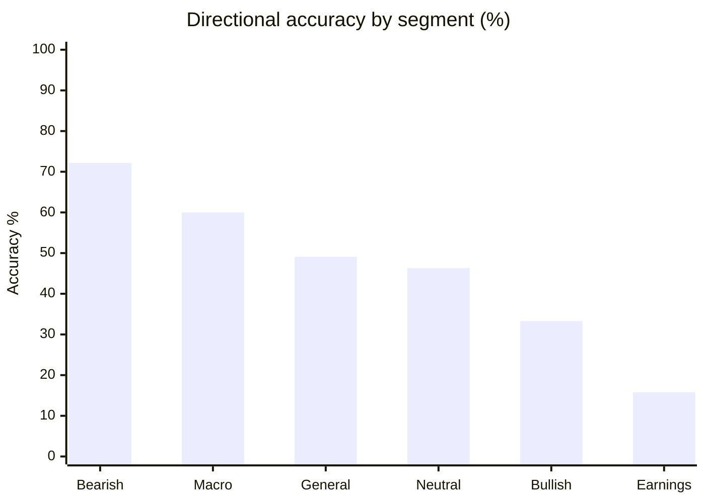

# NewsAlpha

Every day, thousands of financial news articles move stock prices. Most investors read the same headlines and form gut feelings. NewsAlpha asks a different question: **can an LLM reliably predict which direction a stock will move after a news event — and can we actually measure whether it's right?**

This is a full end-to-end answer to that question, built and measured in production.

---

## 🎯 The Problem

Financial news creates noisy, high-volume signal. The conventional wisdom is split: either "the market is efficient and you can't extract alpha from public news," or "sentiment analysis works" — but almost nobody builds a system that rigorously measures both the prediction *and* the outcome at scale.

The two failure modes:
1. **Vibes-based evaluation** — "the model said bullish and the stock went up, seems right!" No baseline, no sample size, no segmentation.
2. **Look-ahead bias** — accidentally using post-reaction prices as the input, making the signal look much better than it is.

---

## ⚙️ What We Built

An automated pipeline that:

1. **Ingests** financial news continuously from 4 sources (Alpaca, Yahoo Finance RSS, CNBC RSS, NewsData.io)
2. **Deduplicates** at three layers — URL hash, time-domain wire-service suppression, and pgvector semantic similarity (so the same story from 5 outlets counts once)
3. **Extracts signals** via a LangGraph reasoning chain: pre-filter (no LLM cost if the article doesn't mention a tracked company) → ticker resolution against a curated 100-stock universe → Claude Haiku reasoning → structured output (direction, confidence, event type)
4. **Measures ground truth** — 5 calendar days later, fetches closing prices from yfinance and asks: was the directional call correct?
5. **Tracks everything** — every LLM call (including rejections), every dollar spent, every price point from T-2 to T+5 per signal

The key design choice: **signals are locked before the T+5 price is ever fetched**. The pipeline is forward-only by construction — no look-ahead bias possible.

### 🔄 Pipeline



### ⏱️ Eval Timeline

The core anti-bias guarantee, visualised:



The signal (direction, confidence) is written at T0 and never modified. The price is fetched days later. The two never touch until evaluation — that's the guarantee.

---

## 📊 Results

First eval wave landed Sep 13, 2026 — 5 days after pipeline went live.

**760 signals extracted · 104 evaluated · 45.2% overall accuracy**



| Segment | n | Accuracy | Signal |
|---------|---|----------|--------|
| Bearish calls | 18 | **72.2%** | Real — model catches downside catalysts |
| Macro events | 20 | **60.0%** | Market-wide news reads well |
| General news | 57 | 49.1% | Near coin-flip |
| Bullish calls | 45 | 33.3% | Below random — positive news already priced in |
| Earnings | 19 | **15.8%** | Classic "buy the rumor, sell the news" inversion |

The bearish accuracy at 72% with n=18 is the most interesting early result — the model is meaningfully better at identifying downside risk than upside. The earnings inversion (15.8%) is a textbook "sell the news" effect — worth inverting as a strategy signal rather than discarding.

Avg abnormal return (signal return minus pre-event T-2→T0 drift): **+0.13%** — the signal adds marginal positive value above trend.

Cost: **$4.71 total · $0.0062 per signal** using Claude Haiku 4.5 with prompt caching.

Full eval wave completes Sep 18 (637 signals still in the T+5 window).

---

## 🧠 How It Works

**LangGraph chain** — two nodes: ticker resolver (Alpaca hint fast-path, or LLM → validate against universe) and reasoning node (structured output via tool call). Every call traced in Langfuse.

**Universe gate** — 100 curated tickers (S&P 500 megacaps, no utilities/REITs/commodity E&P). Signals outside the universe are rejected — no hallucinated tickers reach the DB.

**Cost tracking** — every LLM call writes to `extraction_attempts`, including rejections. Nothing is invisible in the spend report.

**Abnormal return** — T0→T5 raw return minus the T-2→T0 pre-event drift. Isolates the news effect from pre-existing momentum.

---

## 🛠️ Stack

FastAPI + SQLAlchemy 2.0 async + PostgreSQL 16 + pgvector · LangGraph + Claude Haiku 4.5 · Langfuse (self-hosted) · APScheduler · yfinance · React + TypeScript + Vite · FastMCP

---

## 🚀 Run It

```bash
git clone https://github.com/yehomak/NewsAlpha
cp .env.example .env        # ANTHROPIC_API_KEY + ALPACA_API_KEY
docker compose up
```

App → `localhost:8000` · Dashboard → `localhost:5173` · Langfuse → `localhost:3000`

```bash
# Trigger manually
curl -X POST localhost:8000/ingestion/trigger
curl -X POST localhost:8000/signals/trigger
curl -X POST localhost:8000/eval/trigger

# Check results
curl localhost:8000/eval/summary
```

---

## 📁 Dive Deeper

- **[`docs/stages.md`](docs/stages.md)** — how the project was built stage by stage
- **[`app/pipeline/`](app/pipeline/)** — LangGraph chain: nodes, state, runner, universe
- **[`app/eval/`](app/eval/)** — pricer, T0 anchor, 8-point curve, abnormal return
- **[`app/api/routes/`](app/api/routes/)** — FastAPI endpoints
- **[`dashboard/src/`](dashboard/src/)** — React sections mapped to pipeline stages
- **[`CLAUDE.md`](CLAUDE.md)** — full architecture reference
