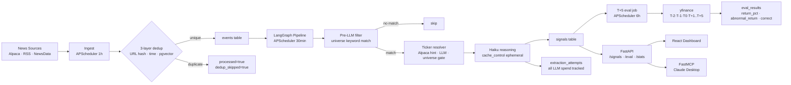

# butterfly-effect

Financial news → LLM signal extraction → ground-truth accuracy measurement.

A pipeline that ingests financial news, extracts directional stock signals via LangGraph reasoning chains, and measures whether those signals were right — at T+5 market days.

## Results (live, Sep 2026)

**760 signals extracted · 104 evaluated · 45.2% overall directional accuracy**

| Segment | Signals | Accuracy | Notes |
|---------|---------|----------|-------|
| Bearish | 18 | **72.2%** | Strongest signal type |
| Macro | 20 | **60.0%** | Broad market events |
| General | 57 | **49.1%** | Near coin-flip |
| Bullish | 45 | **33.3%** | Below random — bullish calls underperform |
| Earnings | 19 | **15.8%** | "Buy the rumor, sell the news" inversion |

Avg T+5 return: −0.36% · Avg abnormal return (vs T-2→T0 pre-drift): +0.13%

Cost: **$4.71 total · $0.0062/signal** (Claude Haiku 4.5)

More signals evaluated daily as T+5 windows close. Full wave completes Sep 18.

## What it does

```
News sources (Alpaca, RSS, NewsData)
  → ingest + 3-layer dedup (URL hash · time-domain · pgvector semantic)
    → LangGraph chain (pre-filter → ticker resolve → Haiku reasoning)
      → signals table (ticker, direction, confidence, event_type, cost)
        → T+5 eval harness (yfinance · 8-point price curve · abnormal return)
          → FastAPI endpoints · React dashboard · FastMCP tools
```

## Architecture



## Stack

| Layer | Tech |
|-------|------|
| API | FastAPI (async) + SQLAlchemy 2.0 async + Alembic |
| DB | PostgreSQL 16 + pgvector (semantic dedup) |
| Pipeline | LangGraph · Claude Haiku 4.5 (`~$0.006/signal`) |
| Embeddings | `all-MiniLM-L6-v2` — local, 384-dim, free |
| Observability | Langfuse (self-hosted) — every LLM call traced |
| Eval | yfinance · T-2 to T+5 price curve · abnormal return calc |
| Scheduler | APScheduler (ingest 1h · pipeline 30min · eval 6h) |
| Dashboard | React + TypeScript + Vite · dark terminal aesthetic |
| MCP | FastMCP · `/signals` + `/eval/summary` as tools |

## Local setup

```bash
git clone https://github.com/yehomak/NewsAlpha
cp .env.example .env        # add ANTHROPIC_API_KEY, ALPACA_API_KEY
docker compose up           # app + postgres + langfuse
```

App: http://localhost:8000  
Dashboard: http://localhost:5173  
Langfuse: http://localhost:3000

Trigger a pipeline run manually:
```bash
curl -X POST http://localhost:8000/ingestion/trigger
curl -X POST http://localhost:8000/signals/trigger
curl -X POST http://localhost:8000/eval/trigger
```

## Signal pipeline detail

**Pre-LLM filter** — scans headline + body for any of 100 curated ticker symbols or company keywords before spending tokens. Rejects ~40% of events before an LLM call.

**Ticker resolver** — Alpaca news API provides pre-resolved ticker hints (fast path). Otherwise: Haiku proposes a ticker → validated against a 100-ticker curated universe (S&P 500 megacaps, excl. utilities/REITs/commodity E&P) → rejected if not in universe.

**Reasoning node** — single Haiku call with `cache_control: ephemeral` on the system prompt (~10-20% cost reduction). Outputs: direction (bullish/bearish/neutral), confidence (0-1), event_type (earnings/product_launch/macro/general), reasoning.

**Cost tracking** — every LLM call (including rejections) written to `extraction_attempts` table. No blind spots in spend reporting.

## Eval design

**No look-ahead bias**: signals are written before T+5 price is fetched. The pipeline is forward-only — signals never see future prices.

**T0 anchor**: if news published during market hours (9:30–16:00 ET) → T0 = publish time. After-hours → T0 = next market open. This prevents inflating accuracy by using post-reaction prices as the baseline.

**8-point price curve**: T-2, T-1, T0, T+1, T+2, T+3, T+4, T+5 stored in `price_snapshots`. Enables signal decay analysis and abnormal return (return minus pre-event drift).

**Correctness**: bullish correct if T0→T5 return > 0; bearish if < 0; neutral if |return| ≤ 1%.

## API

| Endpoint | Description |
|----------|-------------|
| `GET /signals` | List signals; filter by ticker/direction/confidence |
| `GET /signals/{id}` | Single signal + eval result |
| `GET /eval/summary` | Accuracy stats with direction/event_type breakdown |
| `GET /stats/tickers` | Per-ticker accuracy, signal count, last direction |
| `GET /stats/costs` | Daily spend, avg cost/signal |
| `GET /stats/pipeline` | Last run times, signals/events today |
| `POST /*/trigger` | Manual job trigger (202) |

## What the numbers mean

**45.2% overall** is interesting, not discouraging. Disaggregated:
- Bearish at 72% is a real signal — the model catches downside catalysts
- Earnings at 16% confirms the "sell the news" effect — a signal worth inverting
- Bullish at 33% suggests positive news is already priced in before the model sees it
- Abnormal return +0.13% means the signal adds marginal value above the pre-trend

More signal mass (target: 500+ evaluated) needed before drawing strong conclusions on per-ticker or per-confidence-band accuracy.
